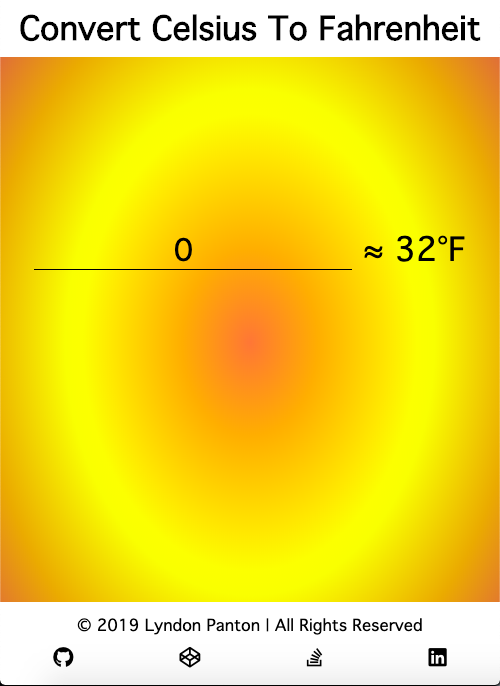
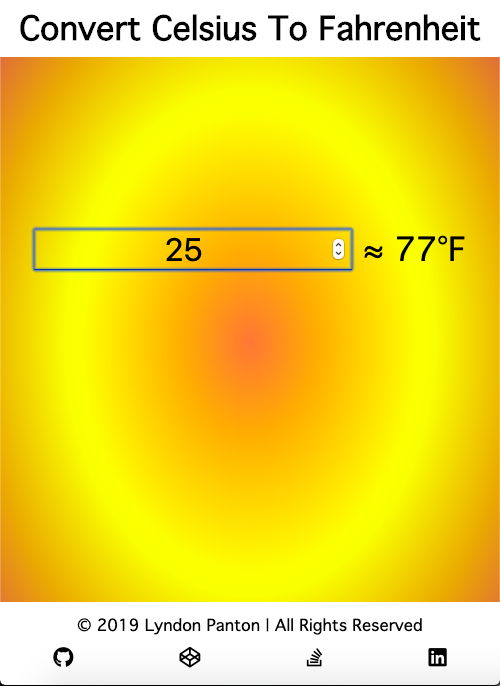
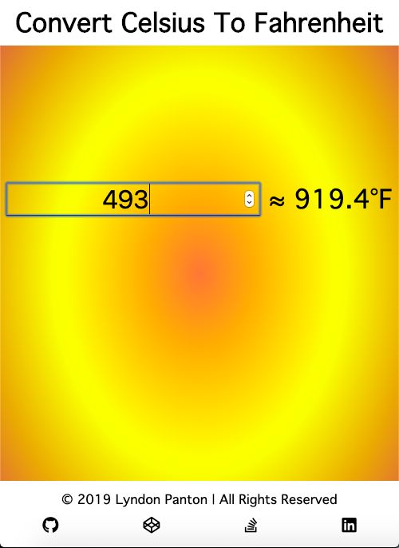

# Convert Celsius To Fahrenheit

## How To Open
> 1. Go to the project's download folder
> 2. Right click on the file named _index.html_
> 3. Choose the _open with_ option
> 4. Open the application in your desired browser

## How to use
> 1. Enter a number that represents a temperature in celsius
> 2. The temperature will be dynamically converted to fahrenheit and displayed on the screen

## Requirements
> 1. This project requires a browser to run
> 2. The browser must have JavaScript available and enabled

## Extra Information
> 1. This was done for one of _freecodecamp_'s _Basic Algorithm Scripting_ activities

## Preview

